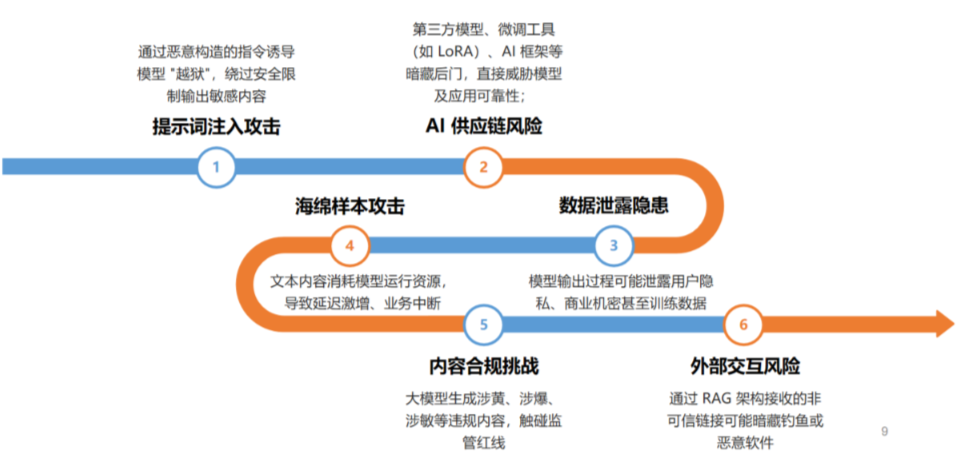
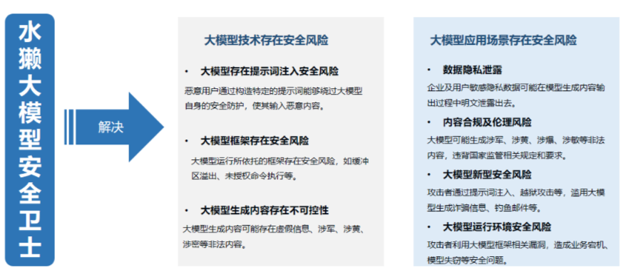
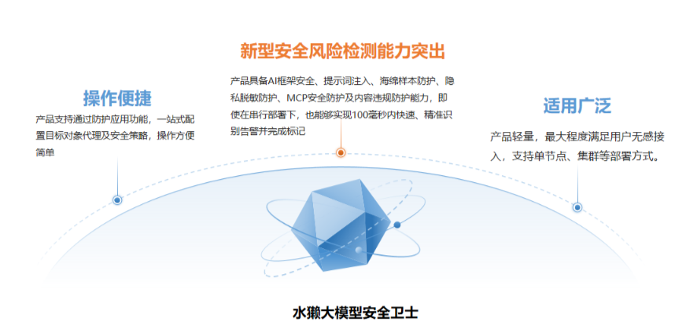
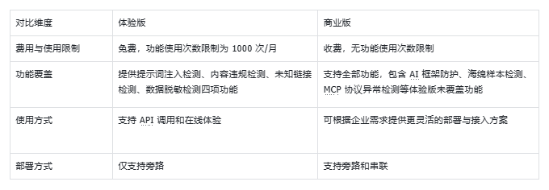

## 一、引言
### 1.1 大模型安全风险背景

随着大规模预训练语言模型（LLM）的出现，ChatGPT、文心一言、通义千问、豆包、Kimi 和 DeepSeek 等国内外大模型广泛接入智能终端、云服务及所在领域场景。人工智能正深刻影响各个领域，被广泛运用于文档撰写、代码编辑、图片生成、资料审核等场景。然而，伴随智能化进程的加速，人工智能新型安全风险的发生也呈逐渐上升趋势。

为了防范和控制人工智能新型安全风险，我们对相关风险进行了研究，相关威胁可概括为六类：

- 提示词注入攻击：通过恶意构造的指令诱导模型 “越狱”，绕过安全限制输出敏感内容；
- 海绵样本攻击：通过构造复杂冗长、具有迷惑性的文本内容消耗模型运行资源，导致延迟激增、业务中断；
- AI 供应链风险：第三方模型、微调工具（如 LoRA）、AI 框架等暗藏后门，直接威胁模型及应用可靠性；
- 数据泄露隐患：模型输出过程可能泄露用户隐私、商业机密甚至训练数据，冲击信息安全底线；
- 内容合规挑战：大模型生成涉黄、涉爆、涉敏等违规内容，触碰监管红线，影响技术应用合法性；
- 外部交互风险：通过 RAG 架构接收的非可信链接可能暗藏钓鱼或恶意软件，攻击者可借此操控大模型输出恶意内容，甚至执行恶意操作。

### 1.2 水獭大模型安全卫士产品概述

为抵御上述安全风险，我们研发了一款大模型安全卫士产品——水獭，英文简称“Otter LLM Guard”。

水獭大模型安全卫士（Otter LLM Guard）是一款专注于大模型安全的产品。它依托 AI 原生安全技术，不仅能实现行业领先的威胁检测准确率，高效拦截各类攻击，还能确保大模型及其应用的性能不受影响，真正做到安全与效率的兼顾。

本文将从核心能力、应对安全风险的功能特性、应用场景，以及体验版与商业版的对比分析等维度，全面展现该产品的全貌。

## 二、 核心安全能力

### 2.1  提示词攻击检测：精准识别 “语义陷阱”

提示词注入攻击，是指攻击者通过精心设计的输入提示词（Prompt），利用模型的 “语义理解漏洞” 绕开安全机制与合规约束，诱导生成违规内容或执行未授权操作。其类型主要分为话术型攻击（如奶奶漏洞、角色扮演、常见假设、诱导攻击等）和算法型攻击（如 GCG、GPT4-Cipher、ArtPropmt 等），目标包括访问权限提升、信息泄露、规避限制等。

Otter LLM Guard 采用多模型协同检测 + MOE（混合专家系统）综合决策机制，实现对复杂攻击的快速精准识别与拦截：
- 多模型专项检测：部署多个专项检测模型，分别针对不同类型的提示词攻击场景深度优化，相关模型有：反向诱导检测模型、目标劫持检测模型、提示词越狱检测模型等。
- MOE 综合决策引擎：基于每个专项模型的检测结果（置信度、攻击类型概率），通过动态权重分配算法进行全局决策。

  
### 2.2  海绵样本检测：阻断 “资源消耗型攻击”

海绵样本攻击是一种典型的 “资源消耗型攻击”，攻击者通过构造复杂且具有迷惑性的文本内容，来消耗大模型的推理资源，进而导致模型延迟激增、业务中断，严重影响大模型应用的正常运转。
针对此类攻击，Otter LLM Guard 凭借高价值的海绵样本库和前沿算法，实现了精准识别与拦截。

  - 专项攻击样本库的构建：Otter LLM Guard 基于自研算法，通过黑盒测试与白盒测试双路径，系统性地采集和生成海绵样本。目前，针对 DeepSeek、通义千文、GPT 等主流大模型，均已构造出大量攻击样本，为精准检测提供了坚实的数据基础。
  - 前沿算法驱动的高效识别：依托该样本库，Otter LLM Guard 采用 “模型检测 + 资源消耗预判” 的前沿算法架构，能够在毫秒级时间内完成对海绵样本的安全标注，快速识别出这类攻击。从而及时采取阻断措施，避免大模型因资源被过度消耗而出现故障，保障大模型应用的稳定运行。

### 2.3 AI 框架流量检测：筑牢 “底层安全防线”

大模型与应用的稳定运行高度依赖底层 AI 框架，一旦框架出现安全漏洞，后果不堪设想。其不仅会导致模型服务中断、业务停摆，更可能成为攻击者入侵主机的突破口，引发数据泄露、模型篡改等严重问题。在金融风控、医疗诊断等关键领域，框架安全隐患甚至会引发系统性风险，因此 AI 框架的安全防护是保障业务连续性与数据安全的核心环节。

Otter LLM Guard 在这方面展现出优秀的 AI 框架流量检测防护能力。依托深厚的技术积淀与专业安全团队构建的 AI 框架防护体系，它首先对 Ray、Ollama、VLLM 等主流框架的中高危漏洞进行深度研究，运用静态审计、动态测试等技术手段精准挖掘漏洞；同时，建立智能情报网络，实时追踪全球安全动态，捕捉新型攻击手法，配合高频更新的特征库，实现毫秒级响应威胁，为 AI 框架构建起动态、高效的安全屏障。

### 2.4 PII 数据脱敏防护：守护 “隐私安全底线”

PII（Personally Identifiable Information）即个人可识别信息，涵盖能直接或间接关联到特定自然人的各类信息。其中，直接标识包括身份证号、手机号等；间接标识有邮箱地址、IP 地址、医疗记录、金融账户信息等。这些信息一旦泄露，可能引发身份盗用、诈骗等风险。

Otter LLM Guard 的 PII 数据脱敏防护作为核心能力之一，专注于守护这些敏感信息的安全。它能够实时对身份证号码、手机号码、邮箱地址、IP 地址等敏感隐私数据进行脱敏输出。通过这样的处理，既能满足合规要求，使客户数据符合相关法律法规；又能实现隐私保护，防止敏感信息在存储、传输、共享等过程中被恶意获取；还能保障业务安全，平衡数据在开发、测试、分析等场景中的合规使用，为个人隐私和企业数据安全筑牢防线。

### 2.5 内容合规检测：筑牢 “内容安全防线”

内容合规检测是大模型安全应用的必要前提，核心是确保生成内容无违法、敏感、恶俗等违规信息，直接关系企业法律责任、品牌声誉与用户信任。

大模型输出违规内容，源于训练数据可能含不良信息，且生成逻辑易因用户诱导、数据偏差产生违规内容。

Otter LLM Guard 的内容合规检测，针对输入输出内容提供 10 余项违规检测，100 毫秒级响应，发现违规可标记告警，并支持自定义阻断、净化等策略，助企业筑牢内容安全防线。

### 2.6 MCP 协议异常检测：守护 “生态交互安全”

MCP 协议是 AI Agent 连接外部工具与数据的关键标准，为 Agent 与数据库、API 接口等外部实体通信搭建标准化桥梁，保障不同架构的工具与数据安全高效对接。

但 MCP 存在安全隐患：例如，数据传输时若加密不足或未强制 HTTPS，可能遭中间人攻击；AI Agent 使用该协议时可能存在命令注入、SSRF 等漏洞，支持远程访问的 MCP 服务则更易被利用。

Otter LLM Guard 具备 MCP 协议异常检测能力，能实时发现协议流量中的威胁并标记，守护 AI 生态交互安全。

### 2.7 未知链接防护：拦截 “恶意入口”

网络钓鱼、恶意软件常以未知链接为攻击媒介，攻击者会用流行网站拼写错误的域或带流量网站名称的子域名，诱骗用户信任，如：info@icbc.com.cn。

攻击者还会通过间接提示注入，将未知链接嵌入文档、对话上下文等，当大模型通过 RAG 等架构接收外部非可信内容辅助响应时，这些链接可能让攻击者操控模型输出恶意内容甚至执行恶意操作，风险极大。

因此，Otter LLM Guard 依据全球前 100 万个最受欢迎的域名标记未知链接并实现防护；还支持用户自定义配置域名，且自定义域名列表内容不会被检测，以此有效拦截恶意入口。

## 三、产品功能特性

### 3.1 新型安全风险检测能力突出

产品覆盖 AI 框架安全、提示词注入、海绵样本、隐私脱敏防护、MCP 安全防护及内容违规等多维度风险检测。
产品检测能力突出，能够实现实时检测；即使在串行部署条件下，也能在 100 毫秒内完成风险识别、告警及标记，响应迅速且精准。

### 3.2 操作便捷

通过防护应用功能，用户可一站式配置目标对象代理及安全策略。该功能操作简单，能降低使用门槛，节省部署与维护时间。

### 3.3 适用广泛

产品采用轻量设计，支持无感接入，且不影响原有系统运行；同时兼容串联、旁路部署，可适配大模型、智能体、具身智能等多种场景。

## 四、产品应用场景

### 4.1 大模型场景

Otter LLM Guard 为各类大模型提供全面防护：基础大模型可通过提示词攻击检测拦截恶意指令，AI 框架防护避免服务中断与数据泄露；垂直领域大模型借助 PII 数据脱敏防护保护隐私，内容合规检测确保输出符合行业监管要求。

### 4.2 智能体场景

针对智能体交互风险，Otter LLM Guard 的 MCP 协议异常检测守护与外部工具、数据的交互安全，防止智能体被操控；未知链接防护拦截恶意链接，避免攻击者借此影响智能体输出或操作，保障任务稳定完成。

### 4.3 具身智能场景

具身智能需兼顾物理与数字安全，Otter LLM Guard 的内容合规检测确保交互内容合规；AI 框架防护保障底层系统安全，避免影响物理动作准确性；PII 数据脱敏防护则保护感知环境中获取的个人信息，让其安全服务人类。

## 五、体验版与商业版对比

为了让大家更加直观的感受Otter LLM Guard，我们推出体验版和商业版，具体差异如下：

## 六、产品体验版入口

Otter LLM Guard 体验版入口：http://47.110.240.234/。

## 七、体验与反馈：共建大模型安全生态

大模型安全生态的构建，离不开每一位用户的参与和支持。我们诚挚邀请您体验水獭大模型安全卫士的体验版与商业版，在实际使用中感受产品的安全防护能力。

无论您选择哪个版本，您的使用体验和反馈都至关重要。您可以通过扫描下方二维码加入Otter LLM Guard 群聊，或微信搜索“Otter LLM Guard 技术交流讨论群”，分享使用过程中的建议、遇到的问题或新的安全需求。这些信息将成为我们优化产品的重要依据 —— 帮助我们打磨功能细节、提升检测精准度、拓展防护场景，让水獭大模型安全卫士更贴合实际应用中的安全防护需求。

我们期待与广大用户携手，以用户反馈为驱动，持续迭代产品，共同抵御大模型安全风险，推动形成更完善、更可靠的大模型安全生态，让 AI 技术在安全的环境中更好地赋能各行各业。

